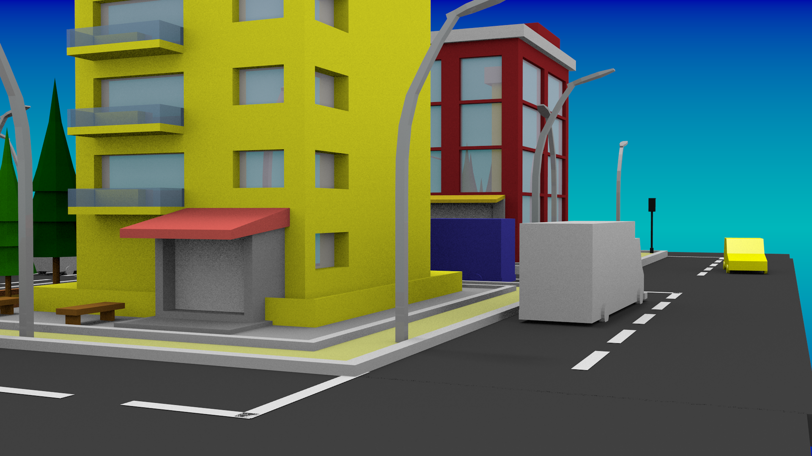
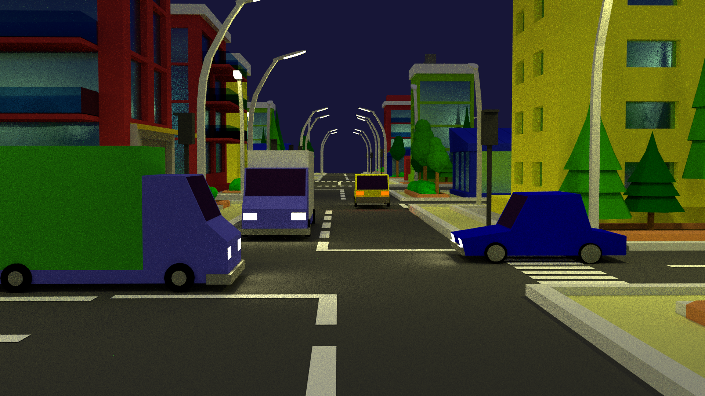

# Low Poly City Animation

Este é um projeto no blender que construí como trabalho final da disciplina de Computação Gráfica na Graduação. 

Consiste de uma animação mostrando uma pequena cidade Low Poly com trânsito.

Ciência da Computação | Universidade Federal do Tocantins

&copy; Mateus Rosario 2019